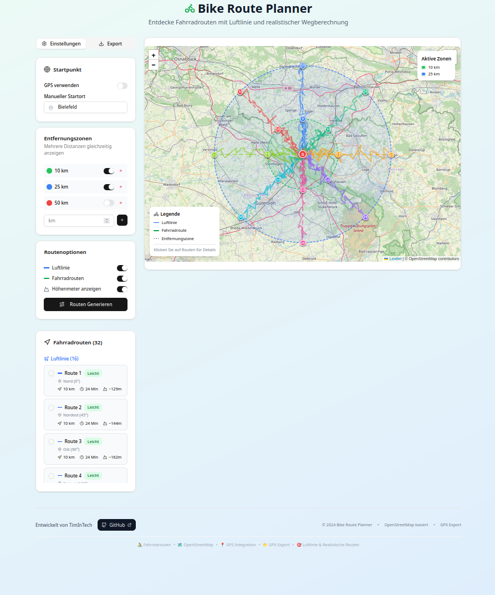

[English](./README.md) | Deutsch

# Bike Route Planner

Interaktive Web-App zur Erkundung erreichbarer Ziele mit Luftlinien-Zonen und realer Fahrradrouten-Berechnung, inkl. GPX-Export.
Unterstützt GPS/manuellen Start, konfigurierbare Entfernungsringe, Routengenerierung, Höhenmeter und Export für Navi-Tools.

<p align="center">
  
</p>


<p align="center">
  
</p>

## Funktionen
- Erreichbare Ziele über konfigurierbare Entfernungsringe erkunden.
- Zwischen Luftlinien-Zonen und real berechneten Fahrradrouten umschalten.
- Startpunkt per GPS oder manuell wählen.
- Mehrere Routenvorschläge mit Distanz- und Zeitangaben.
- Optionale Höhenmeter-Informationen.
- GPX-Export für Navi-Geräte und Apps.
- Responsives UI mit Filtern und Overlays.
- Für schnelle Bereitstellung optimiert.

## Technik
- Framework: Next.js
- Sprache: TypeScript
- Build/Bündelung: Next build
- Karten: Leaflet & OpenStreetMap
- Sonstiges: Tailwind CSS, shadcn/ui, pnpm, Docker, Vercel

## Voraussetzungen
- Node.js ≥ 20
- pnpm oder npm
- Optional: Docker / Docker Compose

## Schnellstart (Lokal)
```bash
pnpm install    # oder: npm install
pnpm dev        # oder: npm run dev
# Produktion:
pnpm build && pnpm start
# alternativer Port:
PORT=3001 pnpm start
```

## Docker
```bash
docker build -t bike-routing-app:latest .
docker run --rm -p 3000:3000 --name bike-routing-app bike-routing-app:latest
# bei Namenskonflikt:
docker rm -f bike-routing-app
# alternativer Host-Port:
docker run --rm -p 3100:3000 --name bike-routing-app bike-routing-app:latest
```

## Docker-Compose
```yaml
services:
  bike-routing-app:
    build: .
    image: bike-routing-app:latest
    container_name: bike-routing-app
    ports: ["3000:3000"]
    environment:
      - NODE_ENV=production
      - PORT=3000
      - HOSTNAME=0.0.0.0
    read_only: true
    tmpfs: [/tmp]
    security_opt: [no-new-privileges:true]
    restart: unless-stopped
```
```bash
docker compose up --build
```

## Konfiguration
PORT (Standard 3000), HOSTNAME (Standard 0.0.0.0)
(optional) MAP_TILE_URL, NOMINATIM_BASE_URL

Build-Output: Next.js standalone oder standardmäßiges .next
Statische Dateien: Public assets under /public and docs/assets

## (Optional) API/Routes
Nur beibehalten, wenn das Repo API-Routen anbietet.

## (Optional) PWA/Offline
Nur falls zutreffend. Routen: , Fallback , Strategie 

## Tests
```bash
pnpm test     # oder: npm run test
```

## Fehlerbehebung
- Port belegt (EADDRINUSE): PORT=3001 setzen oder Port freigeben.
- Containername belegt: docker rm -f bike-routing-app oder anderen --name verwenden.
- Healthcheck: http://127.0.0.1:3000/ im Container prüfen.

## Mitarbeit
Issues melden oder Pull Requests mit klaren Schritten und Screenshots einreichen.

## Lizenz
MIT — siehe LICENSE.
