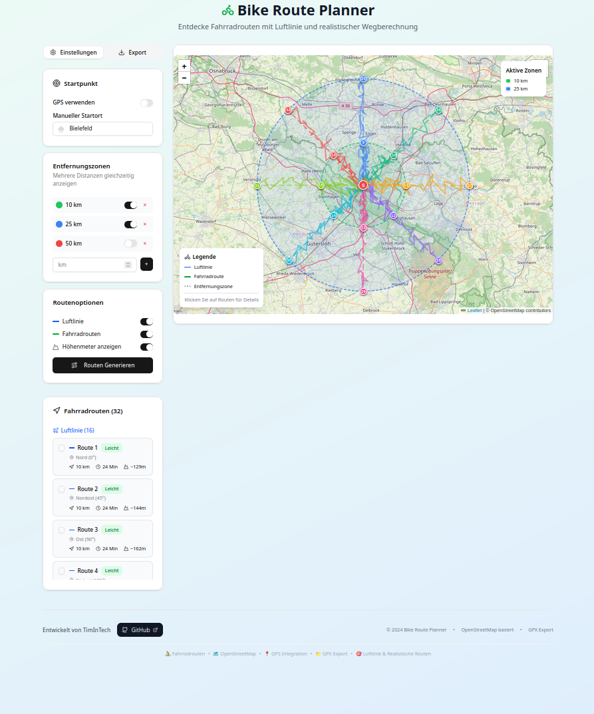

English | [Deutsch](./README.de.md)

# Bike Route Planner

Interactive web app to explore reachable cycling destinations with air-distance zones and realistic bike-route calculation, including GPX export.
Supports GPS/manual start, configurable distance rings, route generation, elevation info, and export for external nav tools.

<p align="center">
  
</p>


<p align="center">
  
</p>

## Features
- Discover reachable cycling destinations with configurable distance rings.
- Toggle straight-line zones and realistic bike-route calculation.
- GPS or manual start selection.
- Multiple route options with distance/time summaries.
- Optional elevation information.
- GPX export for navigation devices/apps.
- Responsive UI with filters and overlays.
- Built for fast load and simple deployment.

## Tech
- Framework: Next.js
- Language: TypeScript
- Build/Bundle: Next build
- Mapping: Leaflet & OpenStreetMap
- Other: Tailwind CSS, shadcn/ui, pnpm, Docker, Vercel

## Requirements
- Node.js ≥ 20
- pnpm or npm
- Optional: Docker / Docker Compose

## Quickstart (Local)
```bash
pnpm install    # or: npm install
pnpm dev        # or: npm run dev
# production:
pnpm build && pnpm start
# alternate port:
PORT=3001 pnpm start
```

## Docker
```bash
docker build -t bike-routing-app:latest .
docker run --rm -p 3000:3000 --name bike-routing-app bike-routing-app:latest
# if name conflict:
docker rm -f bike-routing-app
# alternate host port:
docker run --rm -p 3100:3000 --name bike-routing-app bike-routing-app:latest
```

## Docker Compose
```yaml
services:
  bike-routing-app:
    build: .
    image: bike-routing-app:latest
    container_name: bike-routing-app
    ports: ["3000:3000"]
    environment:
      - NODE_ENV=production
      - PORT=3000
      - HOSTNAME=0.0.0.0
    read_only: true
    tmpfs: [/tmp]
    security_opt: [no-new-privileges:true]
    restart: unless-stopped
```
```bash
docker compose up --build
```

## Configuration
PORT (default 3000), HOSTNAME (default 0.0.0.0)
(optional) MAP_TILE_URL, NOMINATIM_BASE_URL

Build output: Next.js standalone or default .next
Static: Public assets under /public and docs/assets

## (Optional) API / Routes
Keep this section only if the repo exposes API routes.

## (Optional) PWA / Offline
Keep only if applicable. Routes: , fallback , strategy 

## Testing
```bash
pnpm test     # or: npm run test
```

## Troubleshooting
- Port in use (EADDRINUSE): use PORT=3001 or free the port.
- Container name in use: docker rm -f bike-routing-app or change --name.
- Healthcheck: open http://127.0.0.1:3000/ inside the container.

## Contributing
Open issues or pull requests with clear steps and screenshots where relevant.

## License
MIT — see LICENSE.
